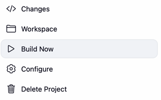
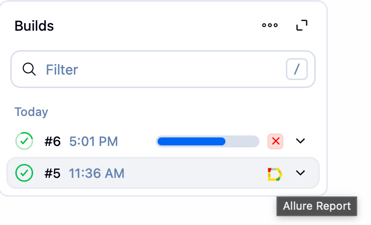
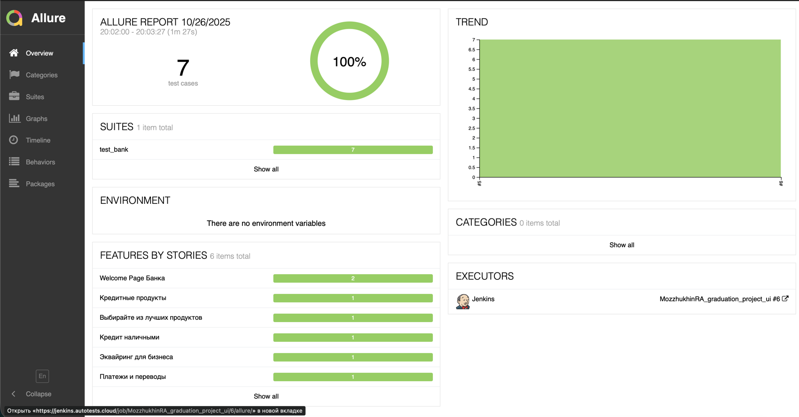
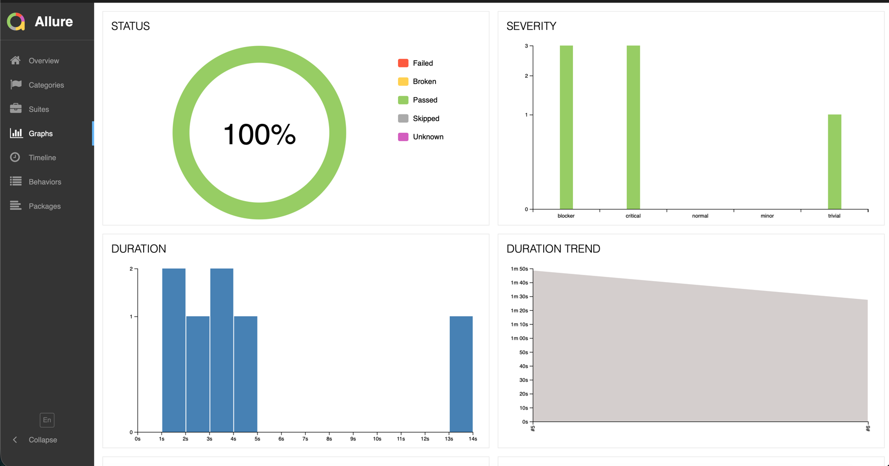
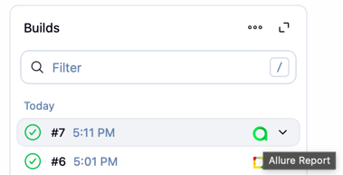
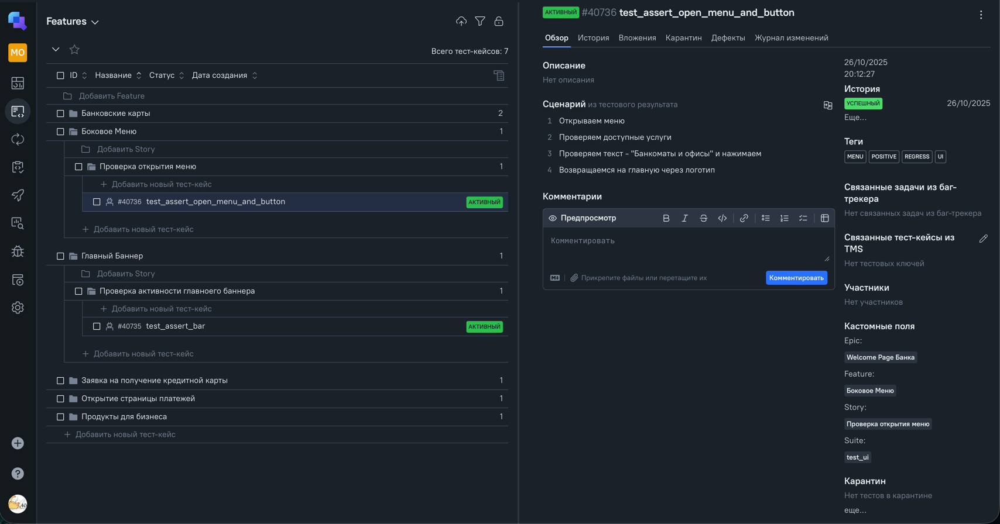
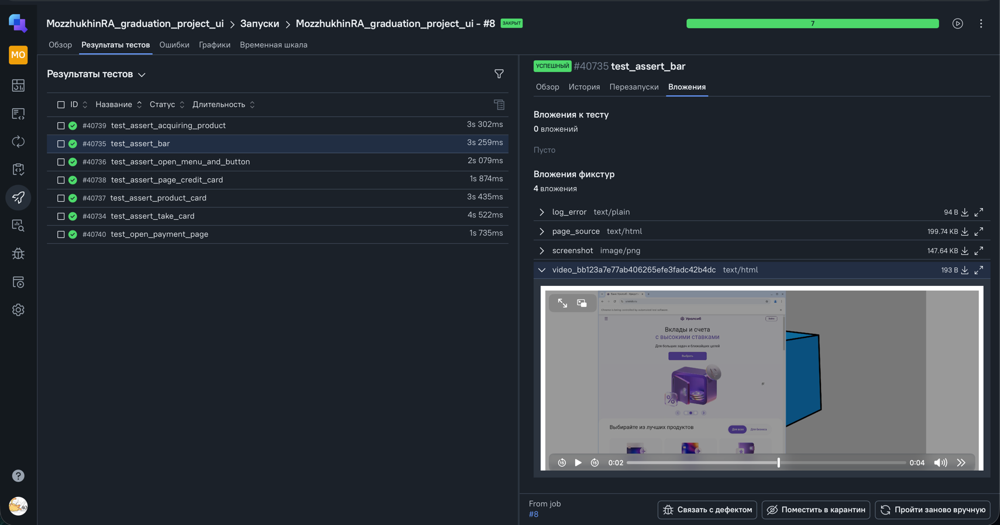
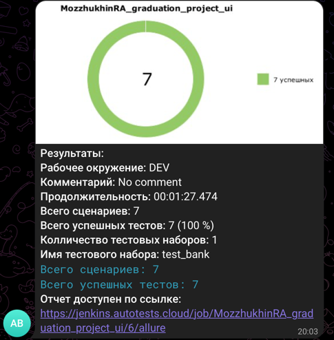

# 🎓 graduation_project_URALSIB

*Дипломный проект по автоматизации страницы УралСиб Банка*

## О проекте

Этот проект является дипломной работой по курсу QA.GURU и представляет собой фреймворк для автоматизации тестирования веб-приложения "UralSib" (https://uralsib.ru). В реализации использованы инструменты и библиотеки:

  
  
  
  
  
  
  <code></code>
  <code></code>
  <code></code>
  <code></code>
  <code></code>

##  Запуск тестов локально

1) Клонировать репозиторий: git clone https://github.com/MozzhukhinRA/graduation_project
2) Активировать окружение и установить зависимости: poetry shell, poetry install
3) Запуск тестов: pytest .
4) Генерацией отчетов Allure: allure serve allure-results

##    Создание сборки на удаленном сервере - Jenkins

1) Авторизоваться в Jenkins
2) Перейти в джобу https://jenkins.autotests.cloud/job/MozzhukhinRA_graduation_project_ui
3) Для запуска тестов в Jenkins нажать "Build Now"

##  Визуализация результатов (Allure Reports и Allure TestOps)

Для просмотра результатов тестового прогона в Allure клик на соответствующую ему иконку

Для просмотра результатов тестового прогона в Allure TestOps кликнув на соответствующую ему иконку в джобе Jenkins

Так же проверить аттачменты - логи, скриншот, видео. Можно, перейдя в раздел "Запуски", завершить Job и провалиться в него

##  Интеграция с Telegram в Jenkins для автоматической отправки результатов тестового прогона через бота

